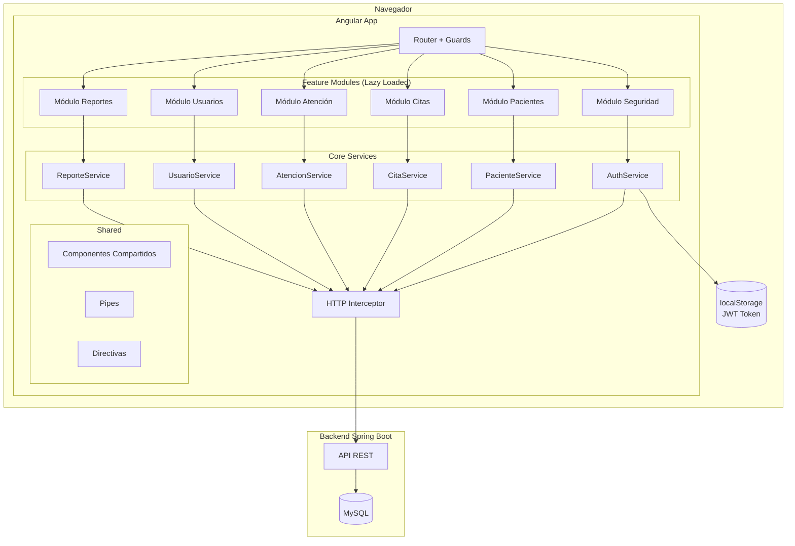
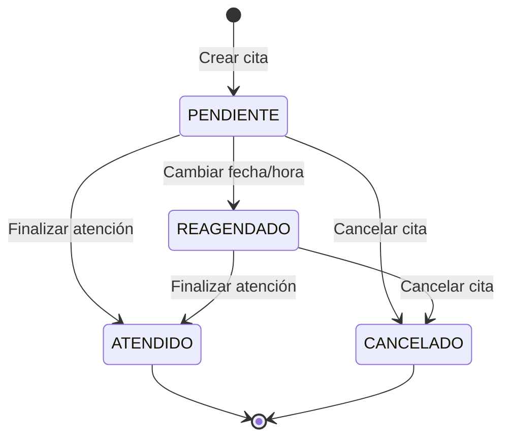
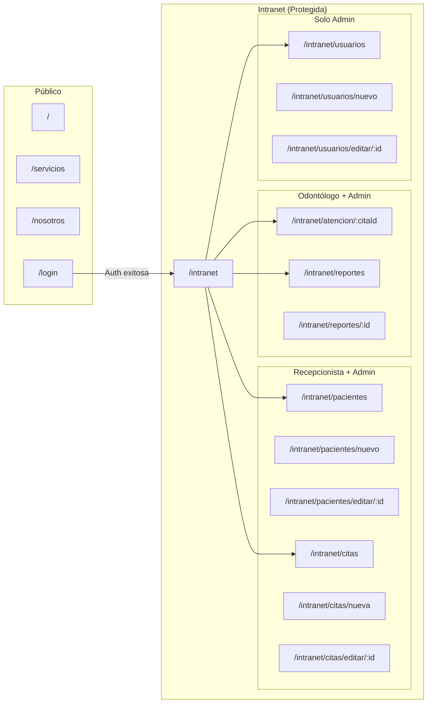
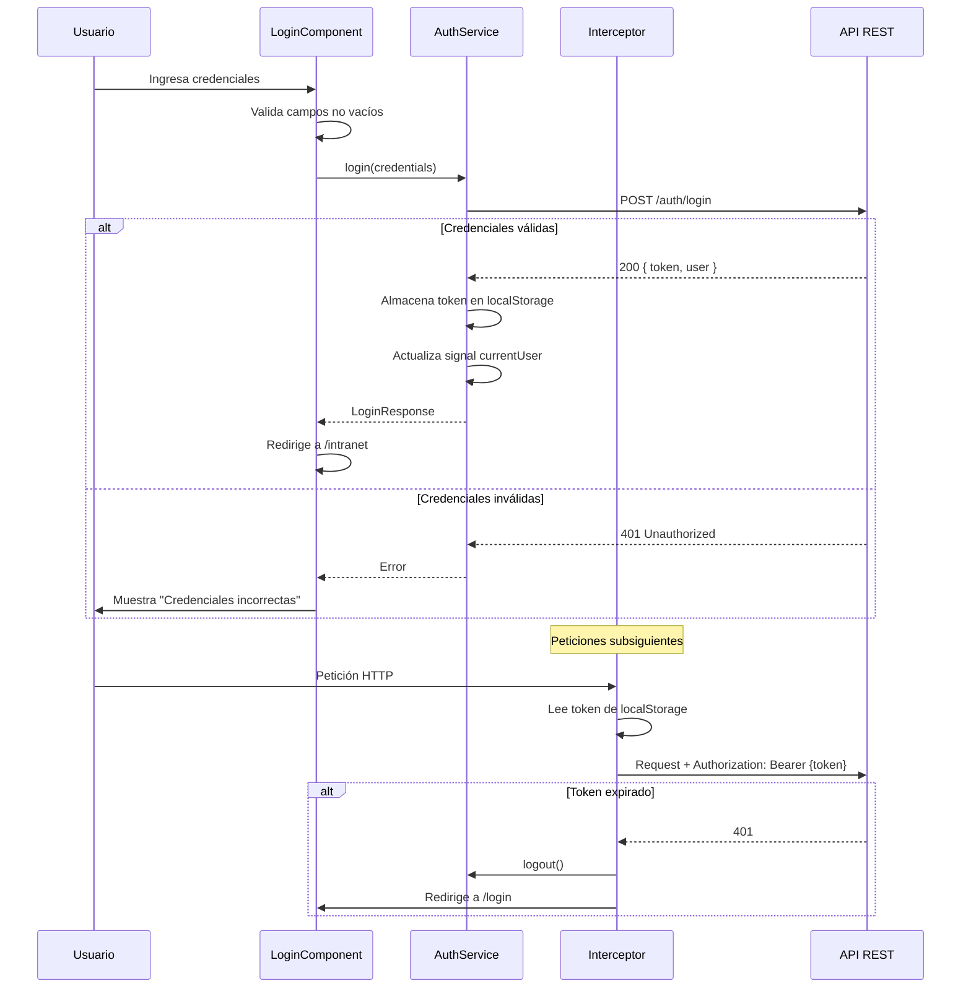
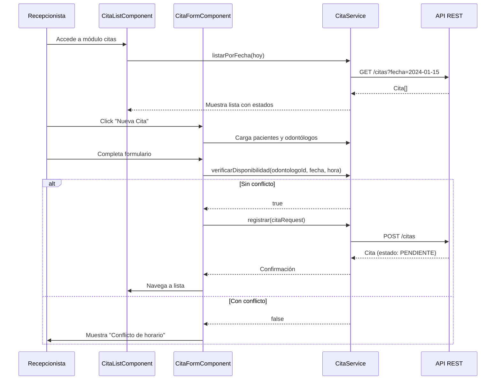

# Documento de Diseño Técnico — Frontend Clínica DentalPro

## Visión General

Este documento describe la arquitectura técnica del frontend de la intranet DentalPro, una aplicación Angular 21+ con standalone components que se comunica con un backend Spring Boot vía API REST. El sistema gestiona pacientes, citas, atención médica, usuarios y reportes, con control de acceso basado en roles (Administrador, Recepcionista, Odontólogo).

### Decisiones de Diseño Clave

| Decisión | Justificación |
|----------|---------------|
| Standalone components | Patrón recomendado en Angular 19+, elimina la necesidad de NgModules |
| Lazy loading por feature | Reduce el bundle inicial y mejora el tiempo de carga |
| Signals para estado reactivo | API moderna de Angular para reactividad sin RxJS innecesario |
| Interceptor funcional | Patrón recomendado en Angular 17+ con `HttpInterceptorFn` |
| Guards funcionales | Patrón moderno con `CanActivateFn` en lugar de clases |
| TailwindCSS 4 | Ya configurado en el proyecto, utility-first para UI consistente |
| Vitest | Ya configurado como test runner del proyecto |

---

## Arquitectura

### Diagrama de Arquitectura General



### Estructura de Carpetas

```
src/app/
├── core/
│   ├── guards/
│   │   ├── auth.guard.ts
│   │   └── role.guard.ts
│   ├── interceptors/
│   │   └── auth.interceptor.ts
│   ├── services/
│   │   ├── auth.service.ts
│   │   └── notification.service.ts
│   └── models/
│       ├── user.model.ts
│       ├── auth.model.ts
│       └── api-response.model.ts
├── shared/
│   ├── components/
│   │   ├── confirm-dialog/
│   │   ├── loading-spinner/
│   │   ├── pagination/
│   │   ├── search-input/
│   │   └── sidebar-layout/
│   ├── pipes/
│   │   └── estado-cita.pipe.ts
│   └── directives/
│       └── role-visible.directive.ts
├── features/
│   ├── auth/
│   │   ├── login/
│   │   │   ├── login.component.ts
│   │   │   ├── login.component.html
│   │   │   └── login.component.css
│   │   └── access-denied/
│   │       └── access-denied.component.ts
│   ├── pacientes/
│   │   ├── services/
│   │   │   └── paciente.service.ts
│   │   ├── models/
│   │   │   └── paciente.model.ts
│   │   ├── paciente-list/
│   │   ├── paciente-form/
│   │   └── pacientes.routes.ts
│   ├── citas/
│   │   ├── services/
│   │   │   └── cita.service.ts
│   │   ├── models/
│   │   │   ├── cita.model.ts
│   │   │   └── estado-cita.model.ts
│   │   ├── cita-list/
│   │   ├── cita-form/
│   │   ├── cita-calendar/
│   │   └── citas.routes.ts
│   ├── atencion/
│   │   ├── services/
│   │   │   └── atencion.service.ts
│   │   ├── models/
│   │   │   └── nota-clinica.model.ts
│   │   ├── atencion-form/
│   │   └── atencion.routes.ts
│   ├── usuarios/
│   │   ├── services/
│   │   │   └── usuario.service.ts
│   │   ├── models/
│   │   │   └── usuario.model.ts
│   │   ├── usuario-list/
│   │   ├── usuario-form/
│   │   └── usuarios.routes.ts
│   └── reportes/
│       ├── services/
│       │   └── reporte.service.ts
│       ├── models/
│       │   └── reporte.model.ts
│       ├── reporte-list/
│       ├── reporte-view/
│       └── reportes.routes.ts
├── layouts/
│   └── intranet-layout/
│       ├── intranet-layout.component.ts
│       ├── intranet-layout.component.html
│       └── intranet-layout.component.css
├── app.config.ts
├── app.routes.ts
└── app.ts
```

---

## Componentes e Interfaces

### Servicios Core

#### AuthService

```typescript
@Injectable({ providedIn: 'root' })
export class AuthService {
  private readonly TOKEN_KEY = 'dental_pro_token';
  
  currentUser = signal<UserProfile | null>(null);
  isAuthenticated = computed(() => this.currentUser() !== null);

  login(credentials: LoginRequest): Observable<LoginResponse>;
  logout(): void;
  getToken(): string | null;
  getUserRole(): UserRole | null;
  isTokenExpired(): boolean;
  private decodeToken(token: string): TokenPayload;
}
```

#### NotificationService

```typescript
@Injectable({ providedIn: 'root' })
export class NotificationService {
  showSuccess(message: string): void;
  showError(message: string): void;
  showWarning(message: string): void;
}
```

### Interceptor HTTP

```typescript
export const authInterceptor: HttpInterceptorFn = (req, next) => {
  // 1. Adjuntar token JWT en header Authorization
  // 2. Configurar timeout de 30 segundos
  // 3. Manejar errores globales (401, 403, 500)
  // 4. Redirigir a login en caso de 401
};
```

### Guards

#### Auth Guard

```typescript
export const authGuard: CanActivateFn = (route, state) => {
  // 1. Verificar existencia del token en localStorage
  // 2. Verificar que el token no esté expirado
  // 3. Si no es válido: eliminar token, redirigir a /login
  // 4. Si es válido: permitir acceso
};
```

#### Role Guard

```typescript
export const roleGuard: CanActivateFn = (route, state) => {
  // 1. Obtener rol del usuario desde el token
  // 2. Obtener roles permitidos desde route.data['roles']
  // 3. Si el rol no está permitido: redirigir a /acceso-denegado
  // 4. Si está permitido: permitir acceso
};
```

### Servicios de Feature

#### PacienteService

```typescript
@Injectable({ providedIn: 'root' })
export class PacienteService {
  private readonly API_URL = environment.apiUrl + '/pacientes';

  listar(page: number, size: number): Observable<PaginatedResponse<Paciente>>;
  buscar(query: string): Observable<Paciente[]>;
  obtenerPorId(id: number): Observable<Paciente>;
  registrar(paciente: PacienteRequest): Observable<Paciente>;
  actualizar(id: number, paciente: PacienteRequest): Observable<Paciente>;
  eliminar(id: number): Observable<void>;
}
```

#### CitaService

```typescript
@Injectable({ providedIn: 'root' })
export class CitaService {
  private readonly API_URL = environment.apiUrl + '/citas';

  listarPorFecha(fecha: string): Observable<Cita[]>;
  obtenerPorId(id: number): Observable<Cita>;
  registrar(cita: CitaRequest): Observable<Cita>;
  actualizar(id: number, cita: CitaRequest): Observable<Cita>;
  cancelar(id: number): Observable<Cita>;
  cambiarEstado(id: number, estado: EstadoCita): Observable<Cita>;
  verificarDisponibilidad(odontologoId: number, fecha: string, hora: string): Observable<boolean>;
}
```

#### AtencionService

```typescript
@Injectable({ providedIn: 'root' })
export class AtencionService {
  private readonly API_URL = environment.apiUrl + '/atenciones';

  registrarNotaClinica(citaId: number, nota: NotaClinicaRequest): Observable<NotaClinica>;
  finalizarAtencion(citaId: number, nota: NotaClinicaRequest): Observable<void>;
}
```

#### UsuarioService

```typescript
@Injectable({ providedIn: 'root' })
export class UsuarioService {
  private readonly API_URL = environment.apiUrl + '/usuarios';

  listar(): Observable<Usuario[]>;
  obtenerPorId(id: number): Observable<Usuario>;
  registrar(usuario: UsuarioRequest): Observable<Usuario>;
  actualizar(id: number, usuario: UsuarioRequest): Observable<Usuario>;
  eliminar(id: number): Observable<void>;
  listarOdontologos(): Observable<Usuario[]>;
}
```

#### ReporteService

```typescript
@Injectable({ providedIn: 'root' })
export class ReporteService {
  private readonly API_URL = environment.apiUrl + '/reportes';

  generar(citaId: number): Observable<Reporte>;
  obtenerPorCita(citaId: number): Observable<Reporte>;
  listar(filtros: ReporteFiltros): Observable<PaginatedResponse<Reporte>>;
  descargarPdf(reporteId: number): Observable<Blob>;
}
```

### Componentes Compartidos

| Componente | Responsabilidad |
|-----------|----------------|
| `ConfirmDialogComponent` | Diálogo modal de confirmación reutilizable |
| `LoadingSpinnerComponent` | Indicador de carga animado |
| `PaginationComponent` | Controles de paginación |
| `SearchInputComponent` | Campo de búsqueda con debounce |
| `SidebarLayoutComponent` | Layout con barra lateral y contenido principal |

---

## Modelos de Datos

### Interfaces TypeScript

```typescript
// === Auth Models ===
export interface LoginRequest {
  email: string;
  password: string;
}

export interface LoginResponse {
  token: string;
  user: UserProfile;
}

export interface UserProfile {
  id: number;
  nombreCompleto: string;
  email: string;
  rol: UserRole;
}

export interface TokenPayload {
  sub: string;
  rol: UserRole;
  exp: number;
  iat: number;
}

export enum UserRole {
  ADMINISTRADOR = 'ADMINISTRADOR',
  RECEPCIONISTA = 'RECEPCIONISTA',
  ODONTOLOGO = 'ODONTOLOGO'
}

// === Paciente Models ===
export interface Paciente {
  id: number;
  nombreCompleto: string;
  dni: string;
  fechaNacimiento: string;
  telefono: string;
  email: string;
  direccion?: string;
  fechaRegistro: string;
}

export interface PacienteRequest {
  nombreCompleto: string;
  dni: string;
  fechaNacimiento: string;
  telefono: string;
  email: string;
  direccion?: string;
}

// === Cita Models ===
export enum EstadoCita {
  PENDIENTE = 'PENDIENTE',
  ATENDIDO = 'ATENDIDO',
  CANCELADO = 'CANCELADO',
  REAGENDADO = 'REAGENDADO'
}

export interface Cita {
  id: number;
  paciente: Paciente;
  odontologo: UserProfile;
  fecha: string;
  hora: string;
  motivo: string;
  estado: EstadoCita;
  fechaCreacion: string;
}

export interface CitaRequest {
  pacienteId: number;
  odontologoId: number;
  fecha: string;
  hora: string;
  motivo: string;
}

// === Atención Models ===
export interface NotaClinica {
  id: number;
  citaId: number;
  diagnostico: string;
  tratamiento: string;
  observaciones: string;
  fechaRegistro: string;
}

export interface NotaClinicaRequest {
  diagnostico: string;
  tratamiento: string;
  observaciones: string;
}

// === Usuario Models ===
export interface Usuario {
  id: number;
  nombreCompleto: string;
  email: string;
  rol: UserRole;
  estado: boolean;
  fechaRegistro: string;
}

export interface UsuarioRequest {
  nombreCompleto: string;
  email: string;
  password: string;
  rol: UserRole;
}

// === Reporte Models ===
export interface Reporte {
  id: number;
  cita: Cita;
  notaClinica: NotaClinica;
  fechaGeneracion: string;
}

export interface ReporteFiltros {
  fechaDesde?: string;
  fechaHasta?: string;
  pacienteId?: number;
  page: number;
  size: number;
}

// === Shared Models ===
export interface PaginatedResponse<T> {
  content: T[];
  totalElements: number;
  totalPages: number;
  currentPage: number;
  size: number;
}

export interface ApiError {
  status: number;
  message: string;
  timestamp: string;
}
```

### Máquina de Estados de Citas



#### Tabla de Transiciones Válidas

| Estado Actual | → PENDIENTE | → ATENDIDO | → CANCELADO | → REAGENDADO |
|--------------|:-----------:|:----------:|:-----------:|:------------:|
| PENDIENTE    | ❌ | ✅ | ✅ | ✅ |
| ATENDIDO     | ❌ | ❌ | ❌ | ❌ |
| CANCELADO    | ❌ | ❌ | ❌ | ❌ |
| REAGENDADO   | ❌ | ✅ | ✅ | ❌ |

---

## Estructura de Rutas

```typescript
// app.routes.ts
export const routes: Routes = [
  // Rutas públicas
  { path: '', component: Home, pathMatch: 'full' },
  { path: 'servicios', component: Servicios },
  { path: 'nosotros', component: Nosotros },
  { path: 'login', component: LoginComponent },
  { path: 'acceso-denegado', component: AccessDeniedComponent },

  // Rutas protegidas de la intranet
  {
    path: 'intranet',
    component: IntranetLayoutComponent,
    canActivate: [authGuard],
    children: [
      { path: '', redirectTo: 'dashboard', pathMatch: 'full' },
      {
        path: 'pacientes',
        loadChildren: () => import('./features/pacientes/pacientes.routes')
          .then(m => m.PACIENTES_ROUTES),
        canActivate: [roleGuard],
        data: { roles: [UserRole.ADMINISTRADOR, UserRole.RECEPCIONISTA] }
      },
      {
        path: 'citas',
        loadChildren: () => import('./features/citas/citas.routes')
          .then(m => m.CITAS_ROUTES),
        canActivate: [roleGuard],
        data: { roles: [UserRole.ADMINISTRADOR, UserRole.RECEPCIONISTA] }
      },
      {
        path: 'atencion',
        loadChildren: () => import('./features/atencion/atencion.routes')
          .then(m => m.ATENCION_ROUTES),
        canActivate: [roleGuard],
        data: { roles: [UserRole.ADMINISTRADOR, UserRole.ODONTOLOGO] }
      },
      {
        path: 'usuarios',
        loadChildren: () => import('./features/usuarios/usuarios.routes')
          .then(m => m.USUARIOS_ROUTES),
        canActivate: [roleGuard],
        data: { roles: [UserRole.ADMINISTRADOR] }
      },
      {
        path: 'reportes',
        loadChildren: () => import('./features/reportes/reportes.routes')
          .then(m => m.REPORTES_ROUTES),
        canActivate: [roleGuard],
        data: { roles: [UserRole.ADMINISTRADOR, UserRole.ODONTOLOGO] }
      }
    ]
  },

  { path: '**', redirectTo: '' }
];
```

### Rutas por Feature

```typescript
// features/pacientes/pacientes.routes.ts
export const PACIENTES_ROUTES: Routes = [
  { path: '', component: PacienteListComponent },
  { path: 'nuevo', component: PacienteFormComponent },
  { path: 'editar/:id', component: PacienteFormComponent }
];

// features/citas/citas.routes.ts
export const CITAS_ROUTES: Routes = [
  { path: '', component: CitaListComponent },
  { path: 'nueva', component: CitaFormComponent },
  { path: 'editar/:id', component: CitaFormComponent }
];

// features/atencion/atencion.routes.ts
export const ATENCION_ROUTES: Routes = [
  { path: ':citaId', component: AtencionFormComponent }
];

// features/usuarios/usuarios.routes.ts
export const USUARIOS_ROUTES: Routes = [
  { path: '', component: UsuarioListComponent },
  { path: 'nuevo', component: UsuarioFormComponent },
  { path: 'editar/:id', component: UsuarioFormComponent }
];

// features/reportes/reportes.routes.ts
export const REPORTES_ROUTES: Routes = [
  { path: '', component: ReporteListComponent },
  { path: ':id', component: ReporteViewComponent }
];
```

### Diagrama de Flujo de Navegación



### Diagrama de Flujo de Datos — Autenticación



### Diagrama de Flujo de Datos — Gestión de Citas



---


## Propiedades de Correctitud

*Una propiedad es una característica o comportamiento que debe mantenerse verdadero en todas las ejecuciones válidas de un sistema — esencialmente, una declaración formal sobre lo que el sistema debe hacer. Las propiedades sirven como puente entre especificaciones legibles por humanos y garantías de correctitud verificables por máquinas.*

### Propiedad 1: Flujo de autenticación round-trip

*Para cualquier* conjunto de credenciales válidas (email y contraseña) enviadas al servicio de autenticación, si el backend retorna un token JWT válido, entonces el token debe quedar almacenado en localStorage Y el usuario debe ser redirigido a la ruta correspondiente a su rol (Administrador → todos los módulos, Recepcionista → pacientes/citas, Odontólogo → atención/reportes).

**Validates: Requirements 1.1, 1.3**

### Propiedad 2: Credenciales inválidas producen error genérico

*Para cualquier* combinación de credenciales inválidas (email incorrecto, contraseña incorrecta, o ambos), el sistema debe mostrar exactamente el mismo mensaje de error genérico sin revelar cuál campo específico es erróneo.

**Validates: Requirements 1.2**

### Propiedad 3: Validación de acceso por token

*Para cualquier* ruta protegida del sistema y cualquier estado del token (ausente, expirado, malformado, o válido), el guard de autenticación debe permitir el acceso únicamente cuando el token existe y no está expirado; en todos los demás casos debe redirigir a la página de login.

**Validates: Requirements 2.1, 2.3, 2.4**

### Propiedad 4: Control de acceso basado en roles

*Para cualquier* combinación de rol de usuario y ruta del sistema, el acceso debe ser concedido si y solo si el rol está incluido en la lista de roles permitidos para esa ruta: Administrador tiene acceso a todas las rutas, Recepcionista solo a pacientes y citas, Odontólogo solo a atención y reportes. Además, la barra lateral de navegación debe mostrar únicamente los módulos accesibles para el rol del usuario autenticado.

**Validates: Requirements 2.2, 2.5, 2.6, 2.7, 15.1**

### Propiedad 5: Validación de formularios rechaza datos inválidos

*Para cualquier* formulario del sistema (paciente, cita, usuario) y cualquier combinación de valores de campos donde al menos un campo obligatorio esté vacío o tenga formato inválido, el sistema debe impedir el envío del formulario y mostrar mensajes de validación específicos para cada campo con error.

**Validates: Requirements 3.2, 3.3, 7.2, 13.3**

### Propiedad 6: Filtrado de búsqueda retorna resultados correctos

*Para cualquier* texto de búsqueda y conjunto de datos, el filtrado debe retornar únicamente los elementos cuyo nombre o identificador (DNI para pacientes, fecha para citas, fecha/paciente para reportes) coincidan parcialmente con el texto ingresado. Todos los elementos que no coincidan deben ser excluidos del resultado.

**Validates: Requirements 4.2, 8.2, 14.4**

### Propiedad 7: Máquina de estados de citas

*Para cualquier* cita en cualquier estado, las únicas transiciones de estado permitidas son: PENDIENTE → {ATENDIDO, CANCELADO, REAGENDADO} y REAGENDADO → {ATENDIDO, CANCELADO}. Los estados ATENDIDO y CANCELADO son terminales (no permiten transiciones). Toda cita recién creada debe tener estado PENDIENTE. Las acciones de edición deben estar deshabilitadas para citas en estados terminales.

**Validates: Requirements 7.6, 9.2, 9.3, 11.1, 11.2, 11.3**

### Propiedad 8: Detección de conflictos de horario

*Para cualquier* odontólogo, fecha y hora donde ya existe una cita programada con estado PENDIENTE o REAGENDADO, el sistema debe detectar el conflicto e impedir la creación o modificación de otra cita en el mismo horario para el mismo odontólogo.

**Validates: Requirements 7.5, 9.4**

### Propiedad 9: Interceptor HTTP adjunta token en todas las peticiones

*Para cualquier* petición HTTP dirigida a la API REST del backend, el interceptor debe adjuntar automáticamente el token JWT en el encabezado `Authorization: Bearer {token}` si el token existe en localStorage.

**Validates: Requirements 16.1**

---

## Manejo de Errores

### Estrategia Global (Interceptor)

| Código HTTP | Acción |
|-------------|--------|
| 401 | Eliminar token, redirigir a `/login` con mensaje "Sesión expirada" |
| 403 | Mostrar notificación "No tiene permisos para esta acción" |
| 500 | Mostrar notificación "Error del servidor. Intente más tarde" |
| Timeout (30s) | Cancelar petición, mostrar "Tiempo de espera agotado" |
| Error de red | Mostrar "Sin conexión. Verifique su red" |

### Estrategia por Componente

- **Formularios**: En caso de error del API, mantener los datos ingresados y mostrar mensaje específico
- **Listas**: Mostrar mensaje de error con botón "Reintentar"
- **Operaciones destructivas**: Mostrar diálogo de confirmación previo; en caso de error, notificar sin alterar el estado

### Implementación del Interceptor

```typescript
export const authInterceptor: HttpInterceptorFn = (req, next) => {
  const authService = inject(AuthService);
  const router = inject(Router);
  const notification = inject(NotificationService);

  const token = authService.getToken();

  let authReq = req;
  if (token) {
    authReq = req.clone({
      setHeaders: { Authorization: `Bearer ${token}` }
    });
  }

  return next(authReq).pipe(
    timeout(30000),
    catchError((error: HttpErrorResponse) => {
      switch (error.status) {
        case 401:
          authService.logout();
          router.navigate(['/login'], { 
            queryParams: { reason: 'session-expired' } 
          });
          break;
        case 403:
          notification.showError('No tiene permisos para realizar esta acción');
          break;
        case 500:
          notification.showError('Error del servidor. Intente más tarde');
          break;
        case 0:
          notification.showError('Sin conexión. Verifique su red');
          break;
      }

      if (error.name === 'TimeoutError') {
        notification.showError('Tiempo de espera agotado');
      }

      return throwError(() => error);
    })
  );
};
```

---

## Estrategia de Testing

### Enfoque Dual

El proyecto utiliza **Vitest** (ya configurado) como test runner. La estrategia combina:

1. **Tests unitarios (example-based)**: Para comportamientos específicos, edge cases y errores
2. **Tests de propiedades (property-based)**: Para propiedades universales que deben cumplirse para todos los inputs válidos

### Librería de Property-Based Testing

Se utilizará **fast-check** con Vitest para los tests de propiedades. Cada test de propiedad debe ejecutar un mínimo de 100 iteraciones.

### Configuración de Tests de Propiedades

```typescript
import { fc } from '@fast-check/vitest';

// Cada test de propiedad debe estar etiquetado con:
// Feature: dental-clinic-frontend, Property {N}: {descripción}
```

### Distribución de Tests

| Tipo | Cobertura | Herramienta |
|------|-----------|-------------|
| Property tests | Propiedades 1-9 (lógica de guards, validación, máquina de estados, interceptor) | fast-check + Vitest |
| Unit tests | Comportamiento de componentes, servicios, interacciones UI | Vitest |
| Integration tests | Flujos completos (login → navegación → operación) | Vitest + Testing Library |

### Tests de Propiedades por Propiedad

| Propiedad | Qué se genera | Qué se verifica |
|-----------|---------------|-----------------|
| P1: Auth round-trip | Credenciales + tokens con roles aleatorios | Token almacenado + redirección correcta |
| P2: Error genérico | Combinaciones de credenciales inválidas | Mismo mensaje siempre |
| P3: Validación de token | Tokens (válidos, expirados, malformados, null) | Guard permite/deniega correctamente |
| P4: Control de roles | Combinaciones rol × ruta | Acceso concedido/denegado según tabla |
| P5: Validación formularios | Campos con valores válidos/inválidos aleatorios | Formulario válido/inválido correctamente |
| P6: Filtrado búsqueda | Listas de datos + queries aleatorias | Resultados coinciden con query |
| P7: Máquina de estados | Estados + transiciones aleatorias | Solo transiciones válidas aceptadas |
| P8: Conflictos horario | Citas existentes + nuevas citas aleatorias | Conflictos detectados correctamente |
| P9: Interceptor token | Peticiones HTTP aleatorias | Header Authorization presente |

### Tests Unitarios Clave

- Login: indicador de carga, deshabilitación de formulario, redirección
- Logout: eliminación de token, redirección
- CRUD Pacientes: diálogos de confirmación, mensajes de error específicos
- Citas: renderizado por estado, colores/etiquetas, carga de selectores
- Atención: envío de nota clínica, cambio de estado a "atendido"
- Reportes: descarga PDF, generación automática
- Interceptor: manejo de 401, 403, 500, timeout

### Etiquetado de Tests de Propiedades

Cada test de propiedad debe incluir un comentario con el formato:

```typescript
// Feature: dental-clinic-frontend, Property 7: Máquina de estados de citas
test.prop('solo permite transiciones válidas de estado', [fcEstado, fcTransicion], (estado, transicion) => {
  // ...
});
```
